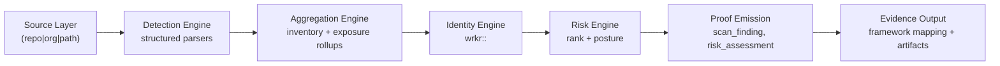

# Wrkr Architecture

Wrkr evaluates your AI dev tool configurations across your GitHub repo/org against policy. Posture-scored, compliance-ready.

## System Boundaries

Wrkr preserves deterministic boundaries so the same input yields stable outputs (excluding explicit timestamp/version fields).

- Source layer
- Detection engine
- Aggregation engine
- Identity engine
- Risk scoring engine
- Proof emission engine
- Compliance mapping/evidence output

## Pipeline Diagram



## Deterministic Invariants

- Structured configs are parsed with typed decoders where possible.
- Secret values are never emitted.
- Risk ordering uses deterministic tie-breakers.
- Exit codes are stable API contracts.

## Command Anchors

```bash
wrkr scan --path ./scenarios/wrkr/scan-mixed-org/repos --json
wrkr score --json
wrkr verify --chain --json
wrkr evidence --frameworks eu-ai-act,soc2 --json
```

## When Not To Use

- Runtime enforcement decisions at tool-side-effect boundaries (that is control-layer scope).
- Dynamic live endpoint probing requirements in default deterministic mode.

## Q&A

### How does Wrkr stay deterministic across different repos?

Wrkr uses structured parsing, deterministic ranking, and stable exit-code contracts. The same input and flags produce the same inventory and posture outputs, excluding explicit timestamp/version fields.

### What command sequence validates the architecture flow end to end?

```bash
wrkr scan --path ./scenarios/wrkr/scan-mixed-org/repos --json
wrkr score --json
wrkr evidence --frameworks eu-ai-act,soc2 --json
wrkr verify --chain --json
```

### Does Wrkr enforce runtime side effects directly?

No. Wrkr is a discovery and posture engine. Runtime enforcement belongs to a control-layer system.
