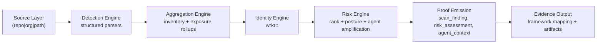

# Wrkr Architecture

Wrkr evaluates AI dev tools and agent declarations across your GitHub repo/org against policy. Posture-scored, compliance-ready.

## System Boundaries

Wrkr preserves deterministic boundaries so the same input yields stable outputs (excluding explicit timestamp/version fields).

- Source layer
- Detection engine
- Aggregation engine
- Identity engine
- Risk scoring engine
- Proof emission engine
- Compliance mapping/evidence output

Wrkr remains the See boundary in See -> Prove -> Control. Discovery, aggregation, scoring, and proof emission live here; downstream compliance packaging is Prove-layer consumption, and runtime enforcement remains out of scope.

## Pipeline Diagram


```mermaid
flowchart LR
  A["Source Layer\n(repo|org|path)"] --> B["Detection Engine\nstructured parsers"]
  B --> C["Aggregation Engine\ninventory + exposure rollups"]
  C --> D["Identity Engine\nwrkr:<tool_id>:<org>"]
  D --> E["Risk Engine\nrank + posture + agent amplification"]
  E --> F["Proof Emission\nscan_finding, risk_assessment, agent_context"]
  F --> G["Evidence Output\nframework mapping + artifacts"]
```

## Deterministic Invariants

- Structured configs are parsed with typed decoders where possible.
- WebMCP JavaScript parsing is AST-only (`goja/parser` + `goja/ast`), never runtime eval.
- Secret values are never emitted.
- Risk ordering uses deterministic tie-breakers.
- Agent-linked attack-path edges and proof context are additive and deterministic.
- Exit codes are stable API contracts.

## Command Anchors

```bash
wrkr scan --path ./scenarios/wrkr/scan-mixed-org/repos --json
wrkr score --json
wrkr verify --chain --json
wrkr evidence --frameworks eu-ai-act,soc2,pci-dss --json
```

## When Not To Use

- Runtime enforcement decisions at tool-side-effect boundaries (that is control-layer scope).
- Dynamic live endpoint probing requirements in default deterministic mode.

## Q&A

### How does Wrkr stay deterministic across different repos?

Wrkr uses structured parsing, deterministic ranking, and stable exit-code contracts. The same input and flags produce the same inventory and posture outputs, excluding explicit timestamp/version fields.

### What command sequence validates the architecture flow end to end?

```bash
wrkr scan --path ./scenarios/wrkr/scan-mixed-org/repos --json
wrkr score --json
wrkr evidence --frameworks eu-ai-act,soc2 --json
wrkr verify --chain --json
```

### Does Wrkr enforce runtime side effects directly?

No. Wrkr is a discovery and posture engine. Runtime enforcement belongs to a control-layer system.

### How is wave sequencing enforced for the tools-plus-agents rollout?

Wrkr keeps the ordered merge-gate contract in [`docs/trust/wave-gates.md`](./trust/wave-gates.md) and `/.github/wave-gates.json`. CI validates the wave contract and blocks scan JSON or exit-code regressions before merge.
