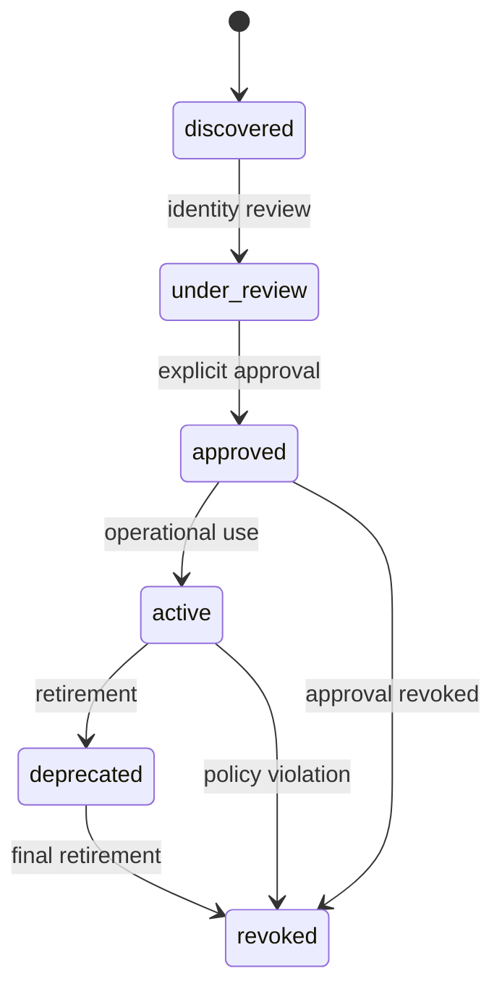
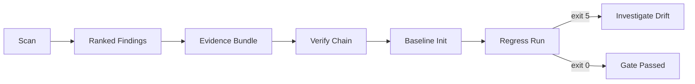

# Wrkr Mental Model

Wrkr evaluates your AI dev tool configurations across your GitHub repo/org against policy. Posture-scored, compliance-ready.

## Problem-First View

Wrkr answers four recurring governance questions:

1. What AI tooling is declared across repo/org surfaces?
2. What access and autonomy context is implied by those declarations?
3. Which risks are most important to act on first?
4. Can we produce deterministic evidence for audits and CI gates?

## Discovery vs Control Boundary

- Wrkr: discovery, posture, risk, lifecycle, evidence.
- Control runtime: tool-boundary side-effect enforcement.

## Identity Lifecycle Model



## Evidence and Drift Loop



## Command Anchors

```bash
wrkr scan --json
wrkr evidence --frameworks eu-ai-act,soc2 --json
wrkr verify --chain --json
wrkr regress run --baseline ./.tmp/wrkr-regress-baseline.json --json
```

## When Not To Use

- You require runtime traffic telemetry rather than static config posture.
- You require non-deterministic heuristic scoring in the default pipeline.

## Q&A

### What is the difference between discovery and control in Wrkr?

Wrkr handles discovery, posture scoring, lifecycle state, and evidence generation. Control systems handle runtime side-effect enforcement.

### Why does Wrkr model identity lifecycle states?

Lifecycle states (`discovered` through `revoked`) make approvals and operational status explicit and auditable across scans.

### What is the recommended drift-management loop?

Use `scan -> evidence -> verify -> regress baseline/run`. Treat regress exit code `5` as your deterministic drift signal.
