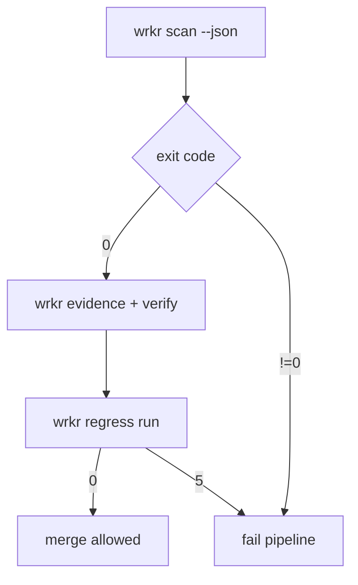

# Integration Checklist

## Goal

Adopt Wrkr in one CI flow with deterministic scan, evidence, and regress gating.

## Checklist

1. Configure deterministic scan target and state path.
2. Run `scan` and `report` in CI.
3. Generate and verify evidence bundle.
4. Initialize baseline and run regress gate.
5. Treat exit codes as API contracts.

## CI Command Set

```bash
wrkr init --non-interactive --path ./scenarios/wrkr/scan-mixed-org/repos --json
wrkr scan --path ./scenarios/wrkr/scan-mixed-org/repos --state ./.tmp/state.json --json
wrkr report --top 5 --json
wrkr evidence --frameworks eu-ai-act,soc2 --state ./.tmp/state.json --output ./.tmp/evidence --json
wrkr verify --chain --state ./.tmp/state.json --json
wrkr regress init --baseline ./.tmp/state.json --output ./.tmp/wrkr-regress-baseline.json --json
wrkr regress run --baseline ./.tmp/wrkr-regress-baseline.json --state ./.tmp/state.json --json
```

## CI Gate Semantics

- Exit `0`: pass
- Exit `5`: drift detected (gate fail)
- Exit `7`: dependency missing
- Exit `8`: unsafe operation blocked

## Pipeline Decision Diagram



## Q&A

### What is the minimum CI sequence to adopt Wrkr in one pipeline?

Run `init`, then `scan`, `report`, `evidence`, `verify`, and `regress run` with `--json` enabled for machine consumption.

### Which exit codes should block merge?

Treat every non-zero exit code as blocking. In practice, `5` is the most common policy gate for drift/regression.

### How do I make outputs easy for agents to consume in CI logs?

Use `--json` for commands and keep outputs as build artifacts so agents can quote stable keys and values.
