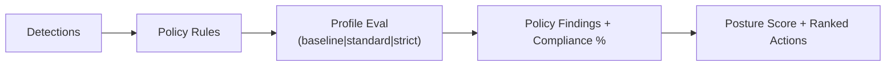

# Policy Authoring

## Policy Sources

Wrkr applies a built-in policy pack and supports repository/local overlays.

- Built-in: `core/policy/rules/builtin.yaml`
- Overlay by file: `--policy <path>`

## Authoring Principles

- Keep rules deterministic and explainable.
- Prefer explicit condition checks over broad pattern matching.
- Fail closed on ambiguous high-risk outcomes.

## Evaluation Flow



## Command Anchors

```bash
wrkr scan --path ./scenarios/wrkr/scan-mixed-org/repos --policy ./fixtures/wrkr-policy.yaml --json
wrkr scan --path ./scenarios/wrkr/scan-mixed-org/repos --profile strict --json
wrkr score --json
```

## Q&A

### Where should custom Wrkr policy overlays live?

Store policy files in-repo (for example `.wrkr/policy.yaml`) and pass them explicitly via `--policy` in CI.

### How do I test policy behavior deterministically?

Run the same `wrkr scan` fixture with fixed flags and compare JSON outputs. Deterministic policy logic should produce stable findings.

### When should I use `--profile strict` versus `--policy`?

Use `--profile strict` for built-in opinionated hardening. Use `--policy` when org-specific controls or exceptions must be encoded explicitly.
